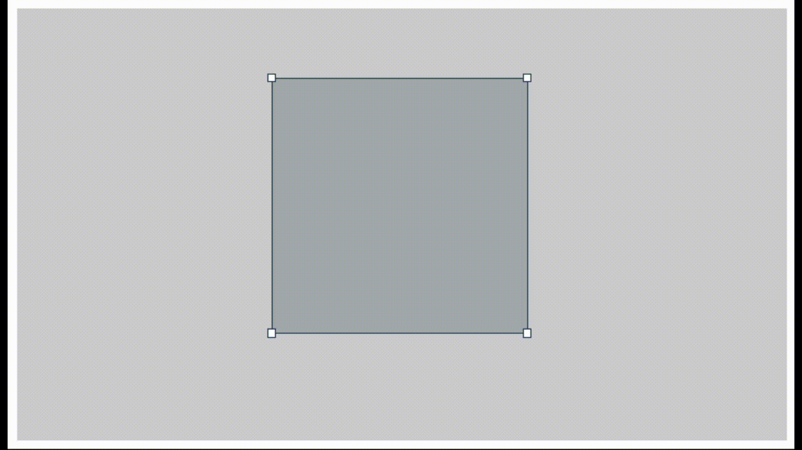
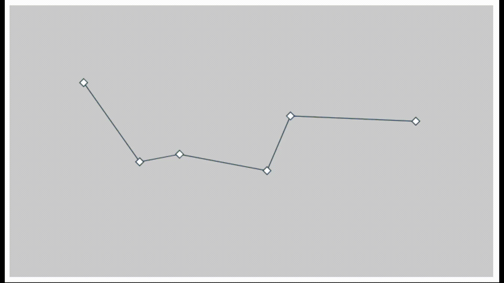

# React Frame Selector

A frame selector component for React.
Select a size and position with a draggable and resizable frame. 

### Screenshots

| FrameSelector                     | KeyframePath                           |
|:----------------------------------|:---------------------------------------|
|  |  | 


### FrameSelector

```tsx
export function App() {
  const containerRef = useRef<HTMLDivElement>(null);
  const [size, setSize] = useState<Size>({ width: 100, height: 100 });
  const [position, setPosition] = useState<Point>({ x: 0, y: 0 });
   
  return (
    <div className={styles.frame__container} ref={containerRef}>
      <FrameSelector
        parentRef={containerRef}
        size={size}
        onSizeChange={setSize}
        position={position}
        onPositionChange={setPosition}
        color={[32, 58, 75]}
      />
    </div>
  );
}
```

### KeyframePath

```tsx
export function App() {
  const containerRef = useRef<HTMLDivElement>(null);
  const [keyframes, setKeyframes] = useState<Keyframe[]>([
    { position: { x: 25, y: 25 }, time: 0 },
    { position: { x: 100, y: 100 }, time: 1 },
    { position: { x: 200, y: 52 }, time: 2 },
    { position: { x: 300, y: 100 }, time: 3 },
    { position: { x: 400, y: 28 }, time: 4 },
    { position: { x: 500, y: 100 }, time: 5 },
  ]);
   
  return (
    <div className={styles.frame__container} ref={containerRef}>
      <KeyframePath
        parentRef={containerRef}
        keyframes={keyframes}
        onKeyframeMove={(index, position) => {
          setKeyframes((keyframes) => {
            const newKeyframes = [...keyframes];
            newKeyframes[index].position = position;
            return newKeyframes;
          });
        }}
        color={[32, 58, 75]}
      />
    </div>
  );
}
```